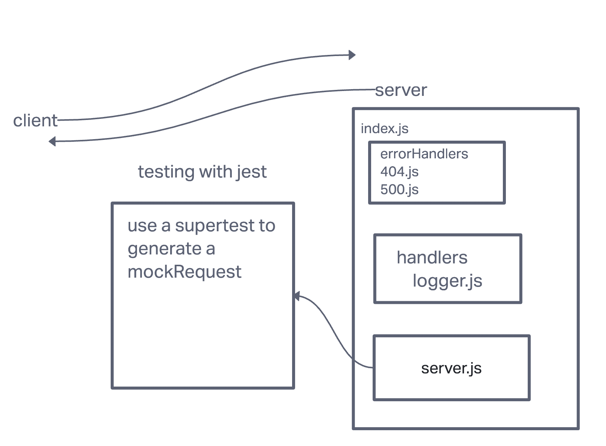

LAB - Class 01

Project: Server Deployment Practice

Author: Ashwini Uppal

Problem Domain
Basic API Server where we write some middleware and practice deployment

Links and Resources

[GitHub Actions ci/cd](https://github.com/ashuppal/server-deployment-practice/actions)

Dev back-end server url
[ci/cd]()
Prod back-end server url

Setup
.env requirements (where applicable)
not necessary for this lab

How to initialize/run your application (where applicable)
e.g. npm start

How to use your library (where applicable)

Features / Routes

Feature One: Deploy as Dev Branch once ci/cd works.

#### Tests

Started with one test for handling the error for middleware logger.js
After that added more tests to check if the code runs as expected for 500 and 404 errors.

 #### UML

